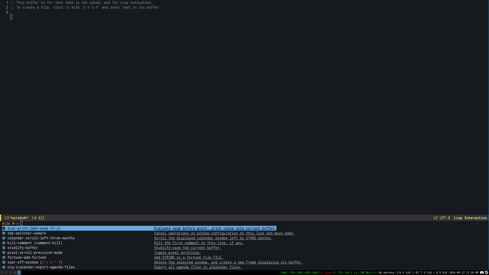
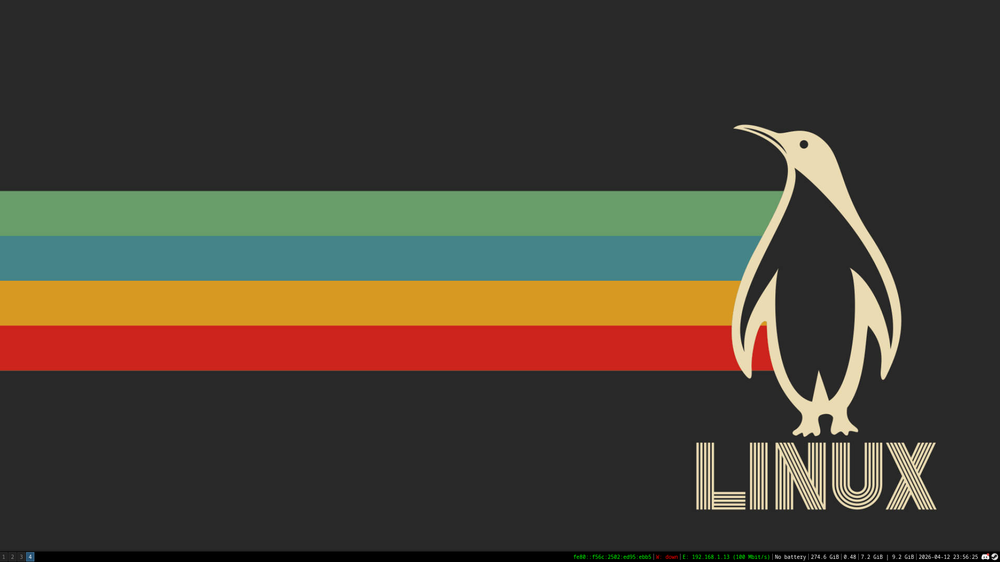

# dotfiles

My personal configuration files for **i3wm**, **Emacs**, and **rofi** on Artix Linux.

> Use at your own risk. These are tailored to my setup — review before applying.

## Contents

- `i3/` — i3 window manager configuration
- `emacs/` — Emacs configuration (init files, packages, themes)
- `rofi/` — rofi launcher configuration and themes

## Requirements

**i3wm + rofi**

```bash
sudo pacman -S i3-wm i3status i3lock rofi
```

**Emacs**

```bash
sudo pacman -S emacs
```

## Installation

Clone the repo:

```bash
git clone https://github.com/barnoun0/dotfiles.git ~/.dotfiles
cd ~/.dotfiles
```

### i3

```bash
mkdir -p ~/.config/i3
ln -sf ~/.dotfiles/i3/config ~/.config/i3/config
```

### Emacs

```bash
ln -sf ~/.dotfiles/emacs/init.el ~/.emacs.d/init.el
```

### rofi

```bash
mkdir -p ~/.config/rofi
ln -sf ~/.dotfiles/rofi/config.rasi ~/.config/rofi/config.rasi
```
## Screenshots
 
 

## System

- **OS:** Artix Linux
- **WM:** i3wm
- **CPU** Ryzen 5 5500
- **GPU** Rtx 3050 OC 8GB
- **Editor:** Emacs
- **Launcher:** rofi
- **Shell:** fish
